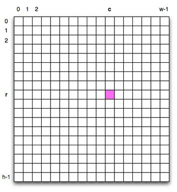
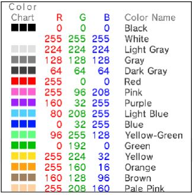

# Pic API

## image.Pic(url)
Creates a new pic object. This will hold all of our pixel information about the image (with some other capabilities too). Make sure to save it in a variable.
* parameter: url - the url of a public image anywhere on the web

```
pic = image.Pic('http://www.sbu.edu/images/default-source/alumni/show-your-spirit-zoom-backgrounds/campus-in-summer.jpg')
```

width and height tell us the dimensions of the image once we have a pic object.

```
print(pic.width)
print(pic.height)
```

## pixels

pixels is a 2D list (a list of lists) that contains the pixels in an image. Use pixels to access any given pixel in the image. The code below would access the highlighted square to the right.

```
col = 10
row = 8
pixel = pic.pixels[row][col]
```



After accessing a pixel, you can access the amount of red, green, and blue in that pixel.

```
r = pixel.red    # this value is 255
g = pixel.green  # this value is 108
b = pixel.blue   # this value is 237
```

You can also change the amount of red/green/blue in that pixel

```
pixel.red = 10     # this value is now 10
pixel.green += 10  # this value is now 118 (the previous value + 10)
pixel.blue = (b - 20)  # this value is 217 (the value in b - 20)
```

## save_image(filename)
* parameter: filename - the name of the file we want to save. We recommend ending filenames with .jpg

After we modify the pixels in an image, we’ll want to save it. The code below will save your modified image as "myImage-red.jpeg"

```
pic.save_image("myImage-red.jpeg")
```

# RGB color chart


